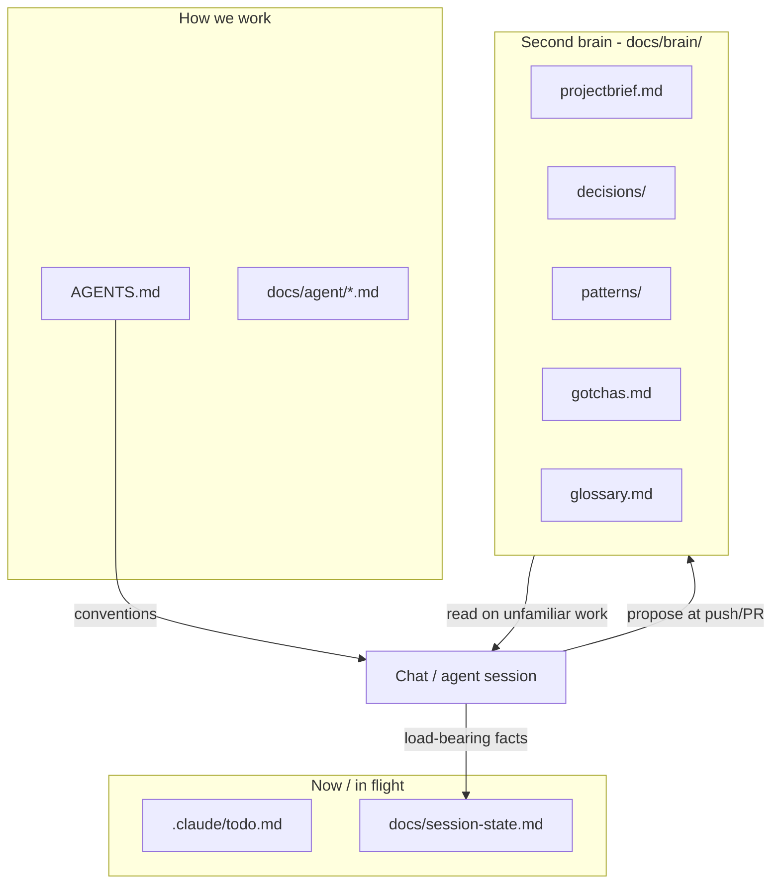

# {{project.name}} Second Brain — visual tour

> Distilled project memory that survives chat compaction.
> **Not** the rulebook (`AGENTS.md`) and **not** today's todo list.

## The big picture



| Layer | Lifetime | Question it answers |
| --- | --- | --- |
| Chat | Minutes–hours | What are we doing *right now*? |
| Session / todo | Days | What's open / blocked? |
| **Brain** | Months–years | Why did we choose this? What bit us? |
| AGENTS / standards | Ongoing rules | How am I *allowed* to code? |

## Folder map — `docs/brain/`

```text
docs/brain/
├── index.md         reading order + maintenance
├── how-it-works.md  this tour
├── projectbrief.md  what {{project.name}} is + hard constraints
├── gotchas.md       index into gotchas/ by domain
├── gotchas/         traps that already hurt, split by domain
├── glossary.md      domain vocabulary
├── decisions/       ADRs (append-only; supersede, never edit in place)
└── patterns/        proven solutions (one file each)
```

## The capture loop

1. Work happens in a Worker slot; `/ship` runs build, review and the commit gate.
2. At push / PR / Merge Gate the agent proposes a brain entry **with its full draft body**.
3. The reply that closes the gate (`Y` / `merge` / `later` / `open-pr-only`) writes it; `no brain` skips it.
4. Next session, agents read `docs/brain/index.md` first on unfamiliar work.

## What to save

| Save | Don't save |
| --- | --- |
| A choice with alternatives and a reason (ADR) | Today's status (use the session-state / todo) |
| A trap that cost time, with the fix (gotcha) | Anything the code or git history already says |
| A proven solution used more than once (pattern) | One-off debugging narrative |
